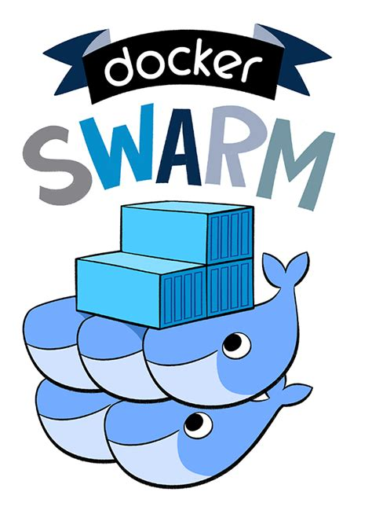

# local-dsc
Local Docker Swarm cluster



---

## IMPORTANT!!
This repo was originally built to support a docker swarm cluster running on MacOSX.  Now, this repo is being updated to support use on Microsoft Windows. As such, the scripts in the `scripts` folder need to be ported to Powershell.

### Windows Notes
- You may recieve an error when trying to run the startup.ps1 and shutdown.ps1 powershell scripts.
- To fix this, you need to run the following command in an elevated powershell window:
    - `Set-ExecutionPolicy -ExecutionPolicy RemoteSigned -Scope CurrentUser`
    - or perhaps try: 
      - `Set-ExecutionPolicy -ExecutionPolicy Unrestricted -Scope CurrentUser`

- This repo must be placed in your home user folder and not on a shared or networked drive.

---

### Usage
1. Push new containers to cloud container repository.
2. Add entries in the stack-compose.yml file and place configs in the configs folder.
3. Start cluster and debug new services in your development repository.

### Launching with NGrok
Here is an example of redirecting localhost:5353 to an nrok.io address. Change the `cjus` to your own subdomain.

```shell
ngrok http --subdomain=cjus 5353
```

---

### Restarting single service

The scripts folder has a handle script called `restart-service.sh` which allows you to redeploy your updated container into the cluster.

The script only requires the full name of your service.

```
$ ./restart-service.sh your-service-v1-svcs
```

This allows you to make local changes to your service and rebuild your test container.  Then you only need to restart the service in the cluster to continue testing.

--

### Shell access to Redis and MongoDB

The scripts folder has two file which allow you to obtain shell access to either Redis or MongoDB.

```shell
cd scripts
./redis-shell.sh
```

```shell
cd scripts
./mongodb-shell.sh
```

---

###  Initial Setup

These steps are required the first time you pull this repository for use.

#### Optional CLI setup

First edit your user root .bash_profile or .zshrc if you're running a recent MacOS with your Docker Hub credentials:

```shell
$ cd ~
$ vim .zshrc
```

```
export DOCKER_PASSWORD='{your_password}'
export DOCKER_USERNAME='{your_username}'
```

After you exit your .bash_profile or .zshrc you'll need to source the file in order to load the updated entries.  Note, this will happen automatically everytime you restart your machine.

```shell
$ source .zshrc
```

---

#### Required Steps

Next, run the one-time-init.sh script which sets up initial security and secrets files.
You only have to do this one-time-init once during this initial setup.
Make sure to cd back into the location where you've installed this repo, then...

```shell
$ cd scripts
$ ./one-time-init.sh
$ cd ..
```

> Note: if this is the first time you've used Docker Swarm then run the `docker swarm init` command before proceeding.

Next load the cluster:

```shell
$  ./startup.sh
```

Wait a minute after the cluster starts and you should be able to see services when you point your brower to http://localhost:5353 or run the `docker ps` command.

Once the script completes you can return to the repo root and shutdown the cluster.

```shell
$ cd ..
$ ./shutdown.sh
```

Confirm that all of the containers have been shutdown using the `docker ps` command.

From this point forward you should be clear to use the cluster normally using the ./startup.sh and ./shudown.sh scripts.

---

### Monitoring

Microservices in this cluster can be viewed via the Hydra Router at http://localhost:5353

---

### Cluster logs

Microservices send logs to the hydra-logging service which writes distributed log entries to `logs/hls.log`

The Bunext tool can be used to query logs:

```
$ bunext -s -e "serviceName==='hydra-healthbot-svcs'" hls.log | jq .
$ bunext -s -e "serviceName==='hydra-healthbot-svcs'" hls.log | jq .body.connectedClients | grep -v null
```

---

### Setting up the Auth service

The auth service requires the creation of an auth.env file inside of the configs/secrets folder.
Make sure to provide the secondary auth provider keys.

```
PROVIDER_MATRIX_URL=
PROVIDER_MATRIX_USER=
PROVIDER_MATRIX_KEY=
```

## Configuring and Launching post services
Post services are other services that are not part of the core cluster but are used run in this cluster. An example of such services are those which you build for your own use.

To configure Post services create a `post-services.yml` file in the scripts/post-services folder.  This file should contain a list of services that you want to run in the cluster.  The format of the file is the same as the `stack-compose.yml` file.

If needed you can add you services config.json files into the configs/post-configs folder. And secrets can be added into the config/post-secrets folder. If you do uses these folder then you'll need to update the `post-services.yml` file to point to the correct locations.

Once you've created the `post-services.yml` file you can start the cluster and the post services will be started.

```shell
cd scripts
./start_post_services.sh
```
